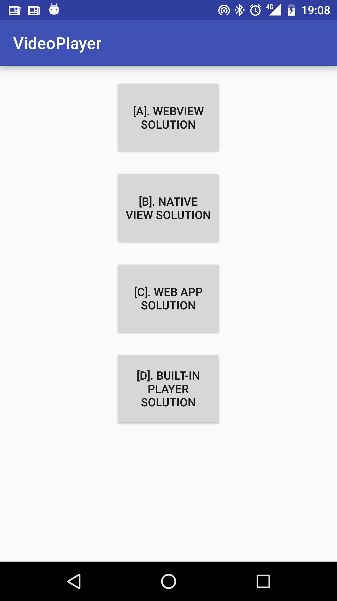
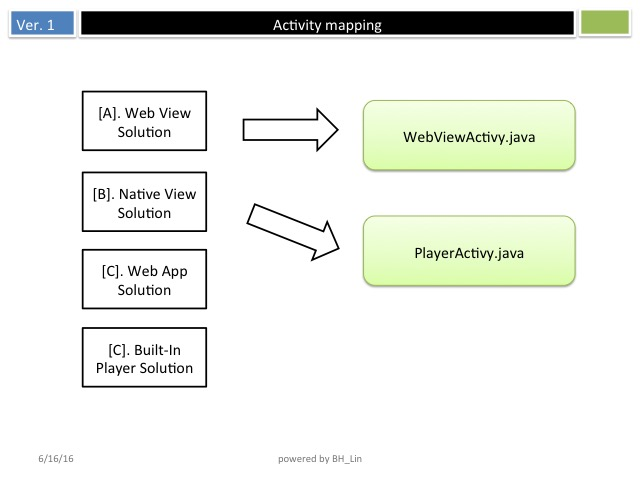
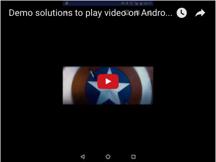

# Video Playback Solution on Android


A comprehensive Android application demonstrating **four different video playback solutions**. This project showcases various approaches to integrate video content in Android applications, each with its own advantages and use cases.

## 📱 Screenshots





## 🎥 Demo
<a href="https://youtu.be/_EFKxrAjipg"></a>

## 🚀 Features

This application demonstrates four distinct video playback approaches:

### A. WebView Solution
- Loads video content through a WebView component
- Displays web-based video player from Firebase hosting
- URL: `https://cmnewsrepublic.firebaseapp.com/videopage.html`
- Ideal for web-based video content integration

### B. Native View Solution  
- Uses Android's native `VideoView` component
- Plays local video files from app resources (`videoplayback.mp4`)
- Includes custom action bar with share, bookmark, and comment menu options
- Provides native media controls with `MediaController`
- Full-screen video playback experience

### C. Web App Solution
- Opens external web application in browser
- Launches Firebase-hosted video page in system browser
- Seamless integration with web-based video services

### D. Built-in Player Solution
- Utilizes Android's default media player
- Streams video directly from remote URL
- Leverages system's native video player capabilities
- Minimal implementation for quick video playback

## 🛠️ Technical Specifications

### Project Structure
```
VideoPlayer/
├── app/
│   ├── src/main/
│   │   ├── java/android/bh/com/videoplayer/
│   │   │   ├── MainActivity.java          # Main menu with 4 options
│   │   │   ├── PlayerActivity.java        # Native video player
│   │   │   └── WebViewActivity.java       # WebView implementation
│   │   ├── res/
│   │   │   ├── layout/                    # UI layouts
│   │   │   ├── menu/                      # Player menu items
│   │   │   ├── drawable/                  # Icons and graphics
│   │   │   └── raw/videoplayback.mp4      # Sample video file
│   │   └── AndroidManifest.xml
│   └── build.gradle
```

### Technical Details
- **Package**: `android.bh.com.videoplayer`
- **Min SDK**: 14 (Android 4.0)
- **Target SDK**: 23 (Android 6.0)
- **Build Tools**: 23.0.3
- **Dependencies**: 
  - AppCompat v7:23.4.0
  - Constraint Layout 1.0.0-alpha3

### Key Components

#### MainActivity.java
- Entry point with four navigation buttons
- Implements click listeners for different video solutions
- Handles intent navigation between activities

#### PlayerActivity.java
- Native video playback using `VideoView`
- Custom action bar with video controls
- Menu integration with share, bookmark, and comment options
- Handles orientation changes and screen configuration

#### WebViewActivity.java
- Simple WebView implementation
- Loads remote video content from Firebase hosting
- Minimal setup for web-based video integration

## 🔧 Setup & Installation

### Prerequisites
- Android Studio
- Android SDK 23 or higher
- Gradle 2.2.0-alpha3 or compatible version

### Installation Steps
1. Clone the repository:
   ```bash
   git clone https://github.com/binghuan/Video_Playback_Solution_on_Android.git
   ```

2. Open the project in Android Studio:
   - Open Android Studio
   - Select "Open an existing Android Studio project"
   - Navigate to the `VideoPlayer` folder

3. Build and run:
   - Let Android Studio sync the project
   - Connect an Android device or start an emulator
   - Click "Run" or press `Ctrl+R` (Windows/Linux) / `Cmd+R` (Mac)

## 📋 Permissions
The app requires the following permission:
- `WRITE_EXTERNAL_STORAGE` - For video file access and caching

## 🎯 Use Cases

This project is perfect for:
- **Learning**: Understanding different video integration approaches in Android
- **Prototyping**: Quick implementation of video features in Android apps
- **Comparison**: Evaluating pros and cons of each video playback method
- **Reference**: Code examples for video implementation in Android projects

## 🔍 Implementation Highlights

### Native VideoView Features
- Automatic media controls
- Orientation change handling
- Custom action bar styling
- Resource-based video loading
- Full-screen playback support

### WebView Integration
- Remote content loading
- Web-based player compatibility
- Minimal code implementation
- Cross-platform video support

### External Player Integration
- System default player utilization
- Stream-based video playback
- Intent-based navigation
- Reduced app complexity

## ⭐ Show Your Support

Give a ⭐ if this project helped you understand Android video implementation!
